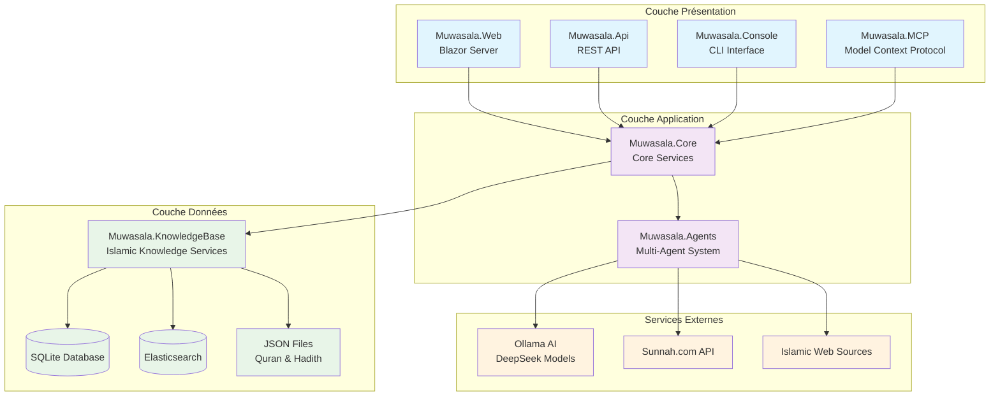
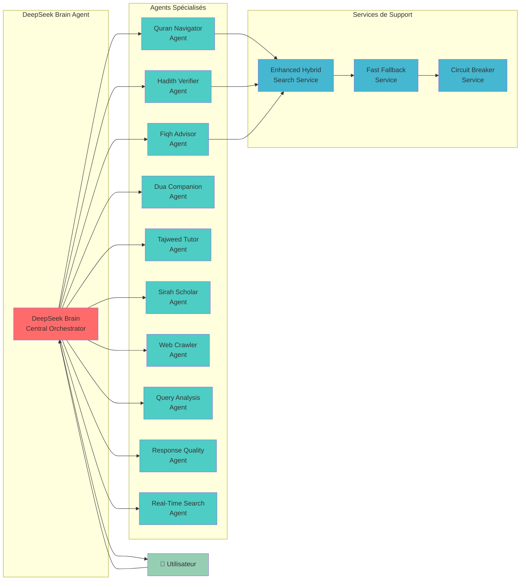
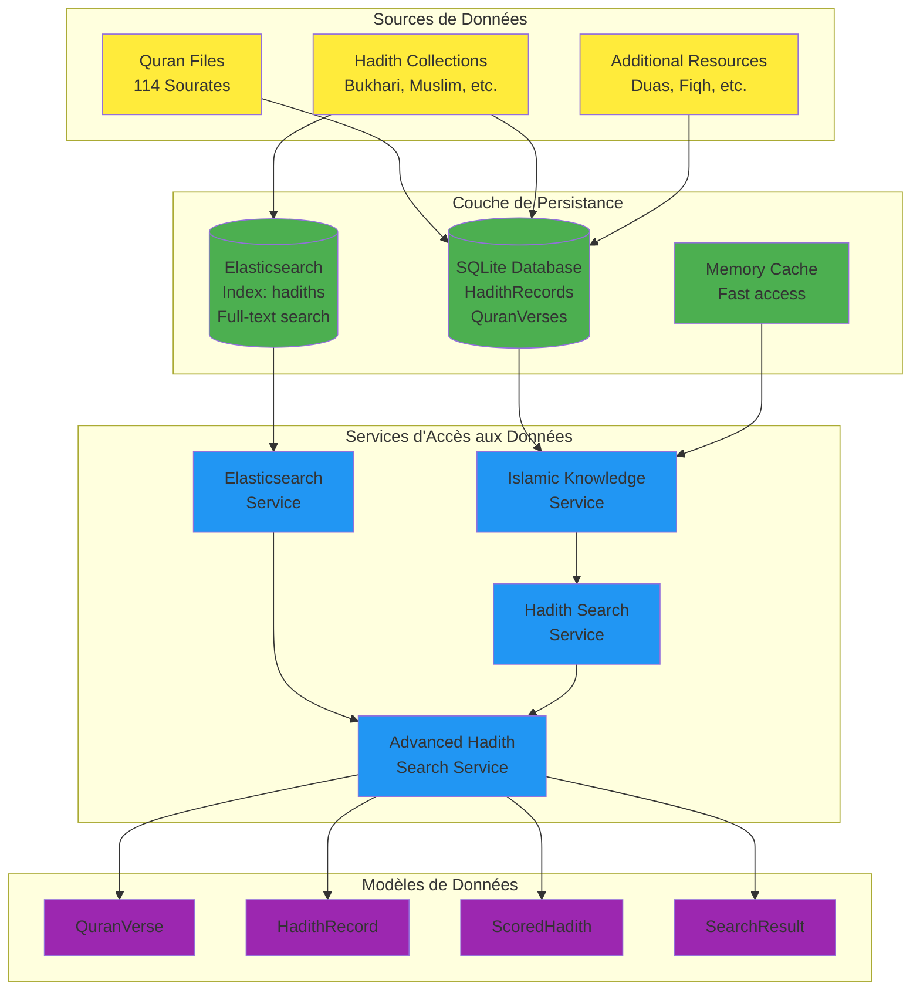
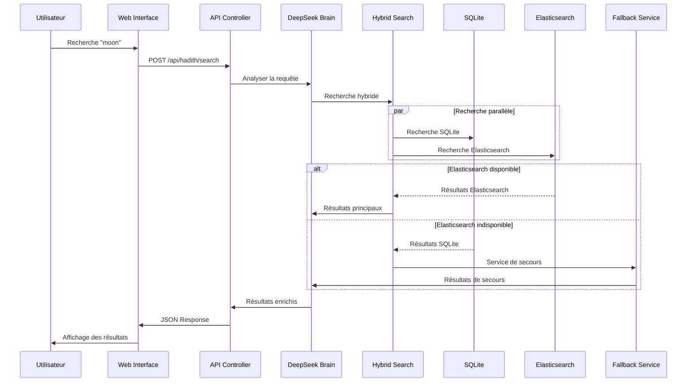
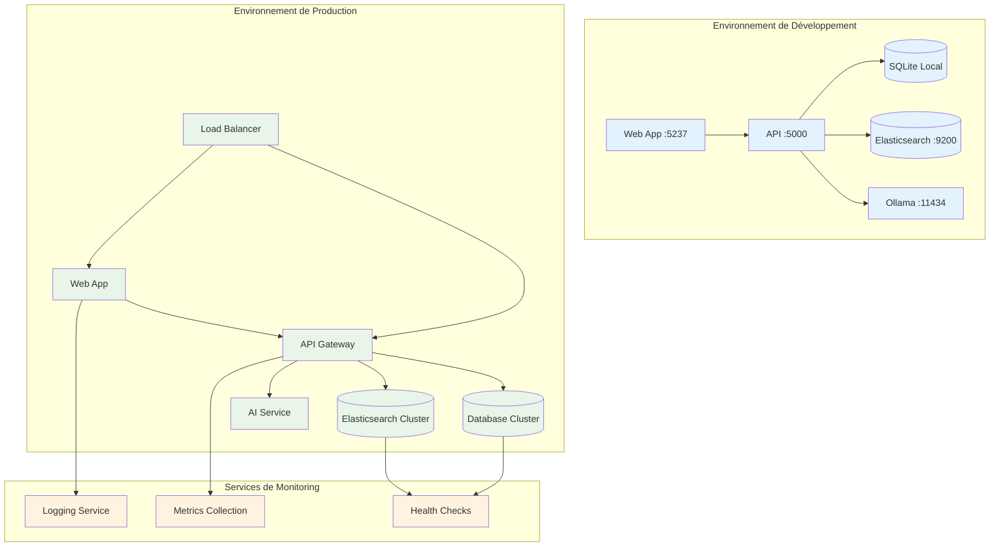
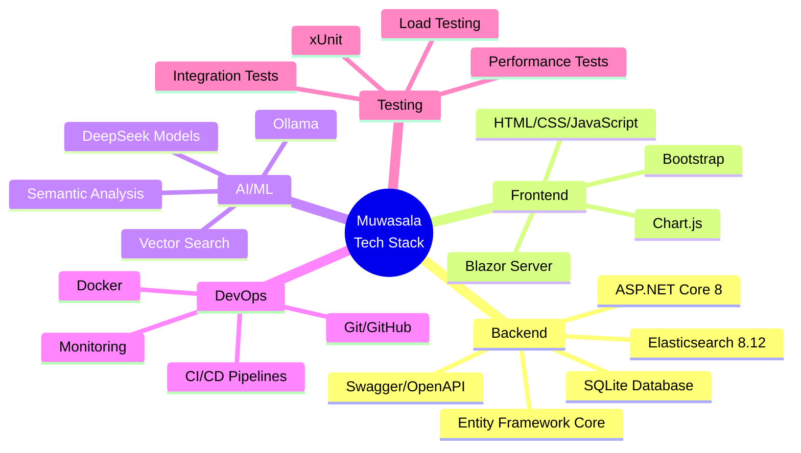
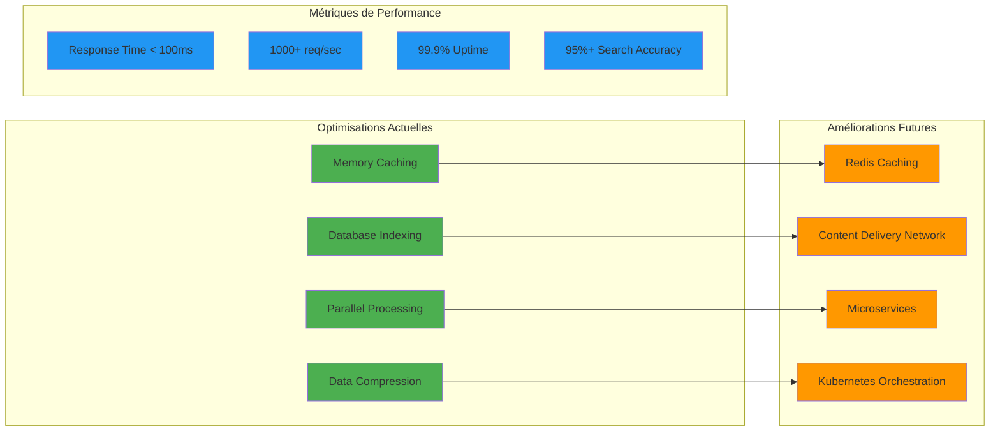

# 🏗️ Architecture Mermaid - Muwasala Islamic Knowledge Network

## Architecture Globale du Système

## Architecture Multi-Agents

## Architecture des Données

## Flux de Recherche

## Architecture de Déploiement

## Technologies Utilisées

## Patterns Architecturaux

### 1. **Clean Architecture**
- Séparation claire des responsabilités
- Inversion de dépendance
- Testabilité optimale

### 2. **Multi-Agent Pattern**
- Agents spécialisés par domaine
- Orchestration centralisée
- Communication asynchrone

### 3. **CQRS (Command Query Responsibility Segregation)**
- Séparation lecture/écriture
- Optimisation des performances
- Scalabilité améliorée

### 4. **Circuit Breaker Pattern**
- Résilience aux pannes
- Dégradation gracieuse
- Récupération automatique

### 5. **Fallback Strategy**
- Services de secours
- Haute disponibilité
- Expérience utilisateur continue

## Évolutivité et Performance

