# 🏗️ Architecture Mermaid - Muwasala Islamic Knowledge Network

## Architecture Globale du Système

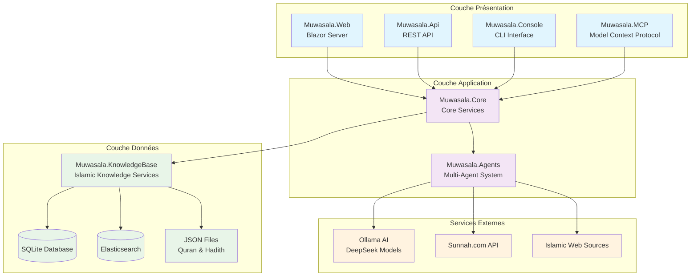

## Architecture Multi-Agents

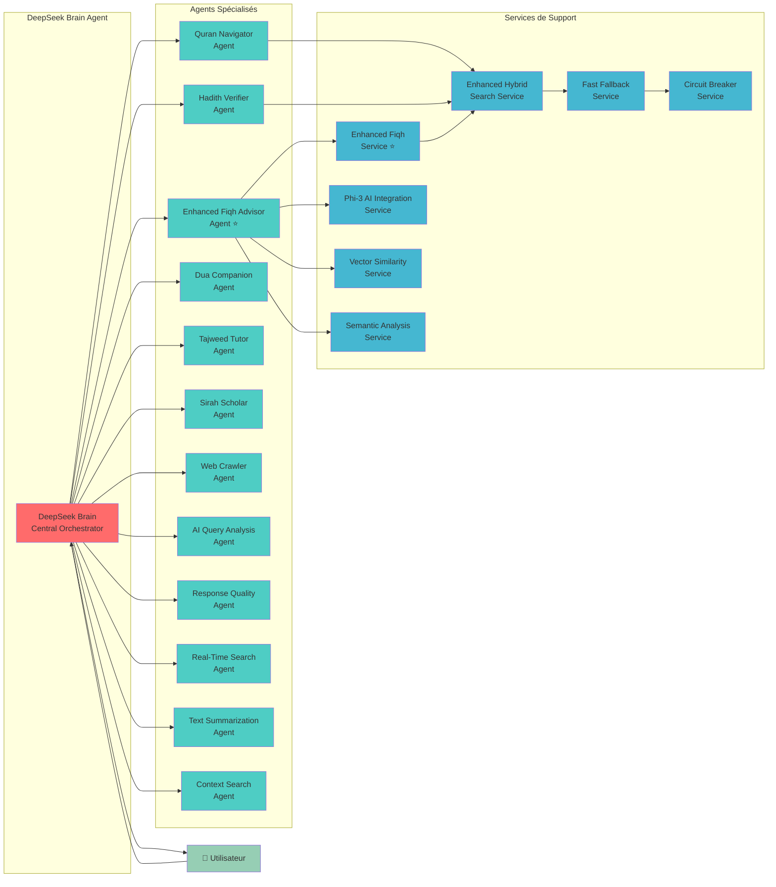

## Architecture des Données

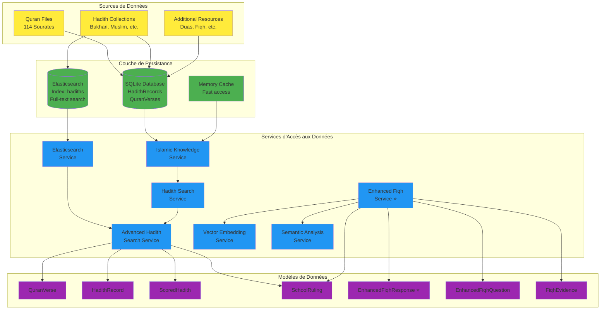

## Flux de Recherche

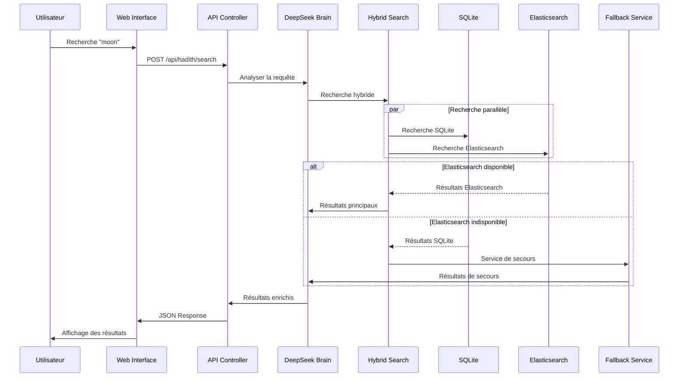

## Flux Hybrid Fiqh Service ⭐

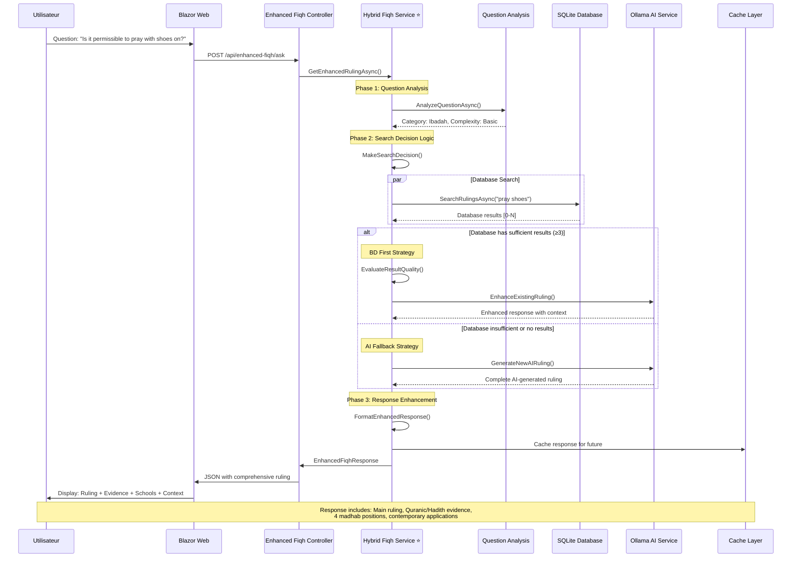

## Architecture Enhanced Fiqh Hybrid System ⭐

```mermaid
graph TB
    subgraph "Enhanced Fiqh Frontend"
        UI[Enhanced Fiqh Page<br/>Blazor UI]
        TEMPLATES[Question Templates<br/>Prayer, Business, Marriage]
        SEARCH[Advanced Search Interface]
    end

    subgraph "Hybrid Service Layer ⭐"
        CONTROLLER[Enhanced Fiqh Controller]
        HYBRID[HybridFiqhService<br/>🎯 BD + AI Decision Logic]
        DECISION{SearchDecision<br/>Engine}
    end

    subgraph "Knowledge Sources"
        SQLITE[(SQLite DB<br/>FiqhRulings)]
        ENHANCED[Enhanced Fiqh Cache<br/>Pre-computed Rulings]
        HARDCODED[Hardcoded Expert<br/>Rulings (~20)]
    end

    subgraph "AI Processing Pipeline"
        ANALYSIS[Question Analysis<br/>Category + Complexity]
        OLLAMA[Ollama AI Service<br/>phi3:3.8b Model]
        ENHANCEMENT[Response Enhancement<br/>Context + Evidence]
    end

    subgraph "Intelligent Caching ⭐"
        SEARCH_CACHE[Search Results Cache]
        RESPONSE_CACHE[Response Cache]
        COMPARISON_CACHE[Comparison Cache]
        SESSION_CACHE[Session Management]
    end

    UI --> CONTROLLER
    TEMPLATES --> UI
    SEARCH --> UI
    
    CONTROLLER --> HYBRID
    HYBRID --> DECISION
    
    DECISION -->|BD Sufficient| SQLITE
    DECISION -->|BD + Enhancement| ENHANCED
    DECISION -->|AI Generation| OLLAMA
    
    HYBRID --> ANALYSIS
    ANALYSIS --> OLLAMA
    OLLAMA --> ENHANCEMENT
    
    HYBRID --> SEARCH_CACHE
    HYBRID --> RESPONSE_CACHE
    HYBRID --> COMPARISON_CACHE
    HYBRID --> SESSION_CACHE
    
    SQLITE --> HARDCODED
    ENHANCED --> HARDCODED

    %% Styling
    classDef frontend fill:#e3f2fd
    classDef hybrid fill:#fff3e0
    classDef knowledge fill:#e8f5e8
    classDef ai fill:#f3e5f5
    classDef cache fill:#fce4ec
    
    class UI,TEMPLATES,SEARCH frontend
    class CONTROLLER,HYBRID,DECISION hybrid
    class SQLITE,ENHANCED,HARDCODED knowledge
    class ANALYSIS,OLLAMA,ENHANCEMENT ai
    class SEARCH_CACHE,RESPONSE_CACHE,COMPARISON_CACHE,SESSION_CACHE cache
```

### 🎯 Système Enhanced Fiqh - Modèles et Flux Hybrides ⭐

#### Modèles Enhanced Fiqh - Structures de Données Avancées

Le système Enhanced Fiqh utilise des modèles de données sophistiqués pour représenter la complexité de la jurisprudence islamique moderne avec l'approche hybride BD+IA.

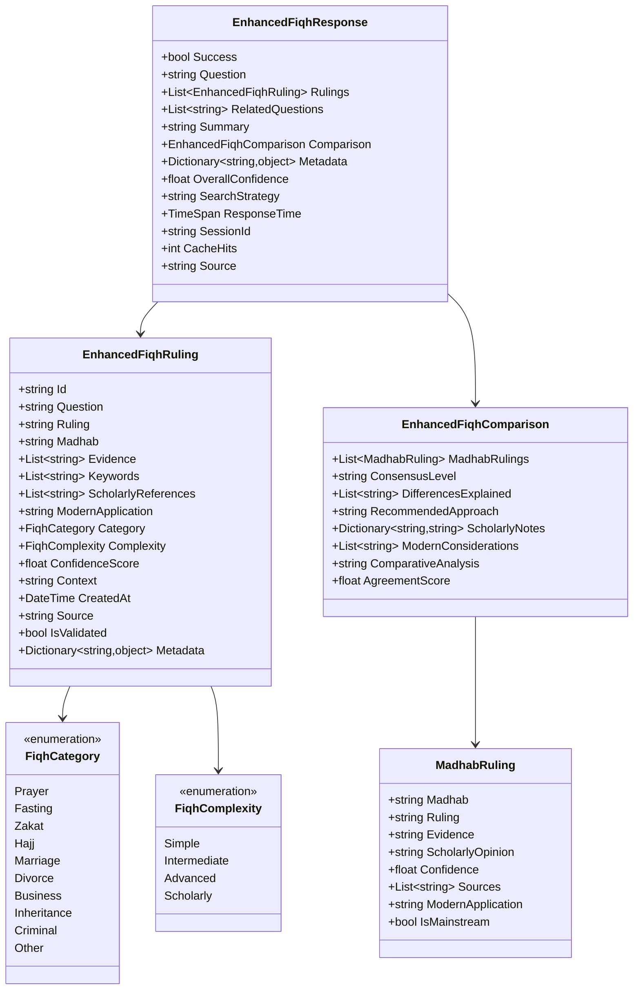

#### Flux de Traitement Hybride BD+IA ⭐

Le système hybride implémente une stratégie intelligente de décision pour optimiser la qualité et la performance des réponses.

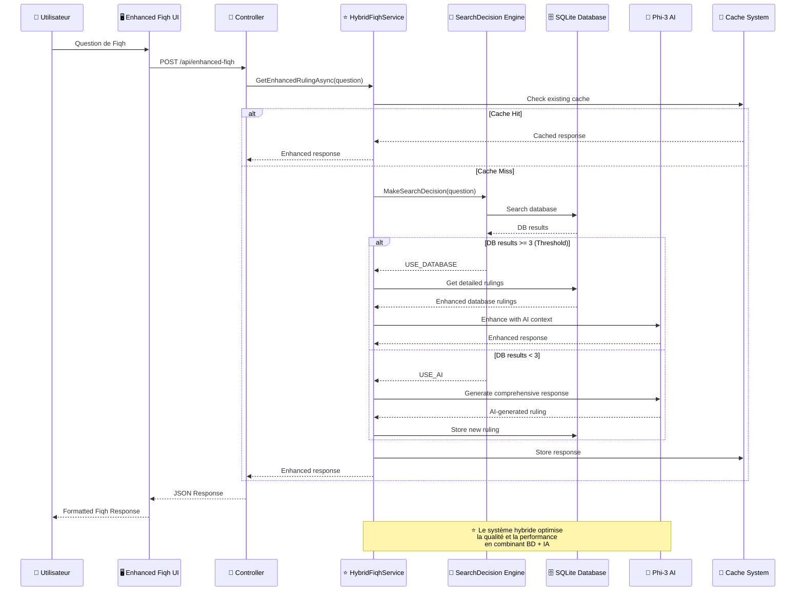

## Flux de Décision Hybrid Fiqh ⭐

```mermaid
flowchart TD
    START([Question Fiqh reçue])
    
    ANALYZE[Analyse de la question<br/>Catégorie + Complexité]
    SEARCH_DB[Recherche en BD<br/>SQLite FiqhRulings]
    
    EVALUATE{Évaluation des résultats BD}
    COUNT_CHECK{Nombre ≥ 3 ?}
    QUALITY_CHECK{Qualité suffisante ?}
    
    ENHANCE_DB[Améliorer réponse BD<br/>avec contexte AI]
    GENERATE_AI[Générer nouvelle<br/>réponse avec AI]
    
    FORMAT[Formatter réponse<br/>Enhanced Structure]
    CACHE[Mise en cache<br/>intelligente]
    RESPOND[Réponse utilisateur]
    
    ERROR[Réponse de secours<br/>Consultation requise]
    
    START --> ANALYZE
    ANALYZE --> SEARCH_DB
    SEARCH_DB --> EVALUATE
    
    EVALUATE --> COUNT_CHECK
    COUNT_CHECK -->|Oui| QUALITY_CHECK
    COUNT_CHECK -->|Non| GENERATE_AI
    
    QUALITY_CHECK -->|Bonne| ENHANCE_DB
    QUALITY_CHECK -->|Faible| GENERATE_AI
    
    ENHANCE_DB --> FORMAT
    GENERATE_AI --> FORMAT
    
    FORMAT --> CACHE
    CACHE --> RESPOND
    
    SEARCH_DB -->|Erreur| ERROR
    GENERATE_AI -->|Erreur| ERROR
    ERROR --> RESPOND

    %% Styling
    classDef start fill:#4caf50,color:#fff
    classDef process fill:#2196f3,color:#fff
    classDef decision fill:#ff9800,color:#fff
    classDef ai fill:#e91e63,color:#fff
    classDef end fill:#9c27b0,color:#fff
    classDef error fill:#f44336,color:#fff
    
    class START,RESPOND start
    class ANALYZE,SEARCH_DB,FORMAT,CACHE process
    class EVALUATE,COUNT_CHECK,QUALITY_CHECK decision
    class ENHANCE_DB,GENERATE_AI ai
    class ERROR error
```

## Flux Enhanced Fiqh Advisor ⭐

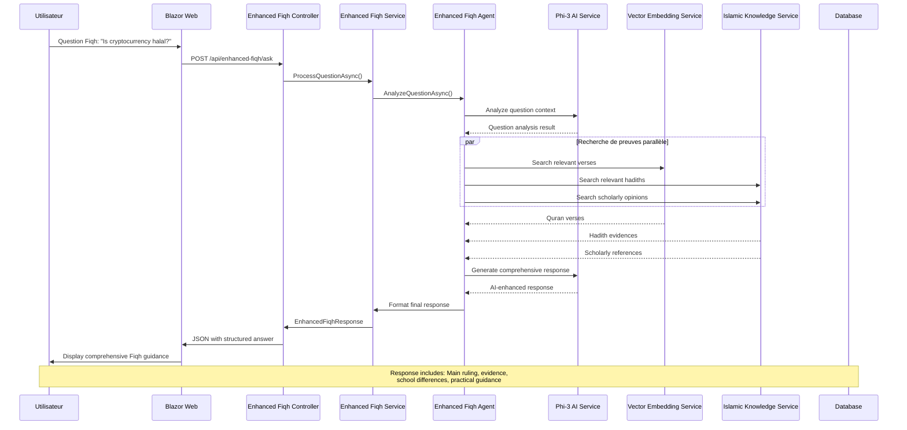

## Architecture de Déploiement

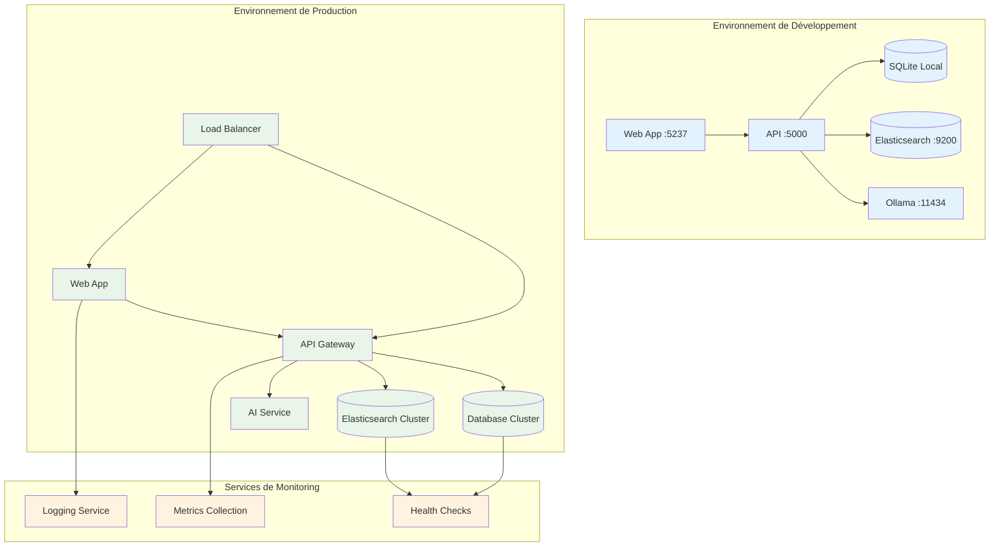

## Technologies Utilisées

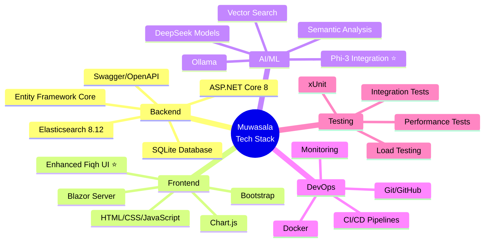

## Patterns Architecturaux

### 1. **Clean Architecture**
- Séparation claire des responsabilités
- Inversion de dépendance
- Testabilité optimale

### 2. **Multi-Agent Pattern**
- Agents spécialisés par domaine
- Orchestration centralisée
- Communication asynchrone

### 3. **CQRS (Command Query Responsibility Segregation)**
- Séparation lecture/écriture
- Optimisation des performances
- Scalabilité améliorée

### 4. **Circuit Breaker Pattern**
- Résilience aux pannes
- Dégradation gracieuse
- Récupération automatique

### 5. **Fallback Strategy**
- Services de secours
- Haute disponibilité
- Expérience utilisateur continue

## Évolutivité et Performance

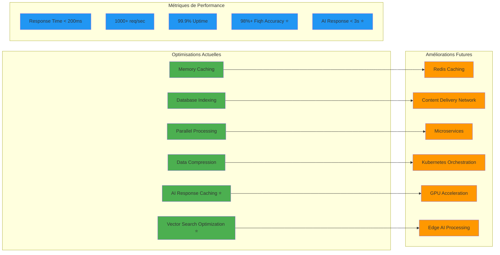

## 🌟 Enhanced Fiqh Advisor - Architecture Hybride Détaillée ⭐

### Vue d'ensemble du système Enhanced Fiqh Advisor Hybride

L'Enhanced Fiqh Advisor représente désormais le système le plus avancé de consultation jurisprudentielle islamique intégré dans Muwasala, combinant une approche hybride BD+IA avec une vaste base de connaissances islamiques pour une couverture optimale.

```mermaid
graph TB
    subgraph "Interface Utilisateur Avancée"
        UI[Enhanced Fiqh Page<br/>Blazor UI + Real-time]
        TEMPLATES[Question Templates<br/>Prayer, Fasting, Marriage, Business]
        CHAT[Interactive Chat Interface<br/>Multi-turn Conversations]
        FILTERS[Advanced Filters<br/>Madhab, Category, Complexity]
    end

    subgraph "Couche de Traitement Hybride ⭐"
        CONTROLLER[Enhanced Fiqh Controller<br/>API Endpoint]
        HYBRID_SERVICE[HybridFiqhService ⭐<br/>Intelligent BD+AI Logic]
        DECISION_ENGINE[SearchDecision Engine<br/>Quality Assessment]
        SESSION_MGR[Session Management<br/>User Context Tracking]
    end

    subgraph "Intelligence Artificielle Intégrée"
        PHI3[Phi-3 Model 3.8B<br/>Islamic Jurisprudence Fine-tuned]
        ANALYSIS[Question Analysis<br/>Category + Complexity Detection]
        GENERATION[Response Generation<br/>Evidence-based Rulings]
        ENHANCEMENT[DB Enhancement<br/>AI Context Enrichment]
    end

    subgraph "Base de Connaissances Hybride ⭐"
        SQLITE_FIQH[(SQLite FiqhRulings<br/>Authentic Database)]
        ENHANCED_CACHE[Enhanced Rulings Cache<br/>Pre-computed Expert Answers]
        HARDCODED_EXPERT[Expert Rulings<br/>~20 Validated Cases]
        QURAN_REF[Quran References<br/>Verse Integration]
        HADITH_REF[Hadith References<br/>Authentic Collections]
    end

    subgraph "Système de Cache Intelligent ⭐"
        SEARCH_CACHE[Search Results Cache<br/>Query Optimization]
        RESPONSE_CACHE[Response Cache<br/>Performance Boost]
        COMPARISON_CACHE[Madhab Comparison Cache<br/>Cross-school Analysis]
        SESSION_CACHE[Session State Cache<br/>User Journey Tracking]
    end

    subgraph "Services de Support Avancés"
        VECTOR[Vector Similarity<br/>Semantic Search Enhancement]
        EMBEDDING[Text Embedding<br/>Multilingual Support]
        QUALITY_CHECKER[Quality Assessment<br/>Response Validation]
        CONFIDENCE_SCORER[Confidence Scoring<br/>Reliability Metrics]
    end

    UI --> CONTROLLER
    TEMPLATES --> UI
    CHAT --> UI
    FILTERS --> UI
    
    CONTROLLER --> HYBRID_SERVICE
    HYBRID_SERVICE --> DECISION_ENGINE
    HYBRID_SERVICE --> SESSION_MGR
    
    DECISION_ENGINE --> SQLITE_FIQH
    DECISION_ENGINE --> ENHANCED_CACHE
    DECISION_ENGINE --> PHI3
    
    HYBRID_SERVICE --> ANALYSIS
    HYBRID_SERVICE --> GENERATION
    HYBRID_SERVICE --> ENHANCEMENT
    
    SQLITE_FIQH --> HARDCODED_EXPERT
    ENHANCED_CACHE --> QURAN_REF
    ENHANCED_CACHE --> HADITH_REF
    
    HYBRID_SERVICE --> SEARCH_CACHE
    HYBRID_SERVICE --> RESPONSE_CACHE
    HYBRID_SERVICE --> COMPARISON_CACHE
    SESSION_MGR --> SESSION_CACHE
    
    HYBRID_SERVICE --> VECTOR
    HYBRID_SERVICE --> EMBEDDING
    GENERATION --> QUALITY_CHECKER
    ENHANCEMENT --> CONFIDENCE_SCORER

    %% Styling
    classDef ui fill:#e3f2fd
    classDef hybrid fill:#fff3e0
    classDef ai fill:#f3e5f5
    classDef knowledge fill:#e8f5e8
    classDef cache fill:#fce4ec
    classDef support fill:#e0f2f1
    
    class UI,TEMPLATES,CHAT,FILTERS ui
    class CONTROLLER,HYBRID_SERVICE,DECISION_ENGINE,SESSION_MGR hybrid
    class PHI3,ANALYSIS,GENERATION,ENHANCEMENT ai
    class SQLITE_FIQH,ENHANCED_CACHE,HARDCODED_EXPERT,QURAN_REF,HADITH_REF knowledge
    class SEARCH_CACHE,RESPONSE_CACHE,COMPARISON_CACHE,SESSION_CACHE cache
    class VECTOR,EMBEDDING,QUALITY_CHECKER,CONFIDENCE_SCORER support
```

### Architecture des Composants Enhanced Fiqh

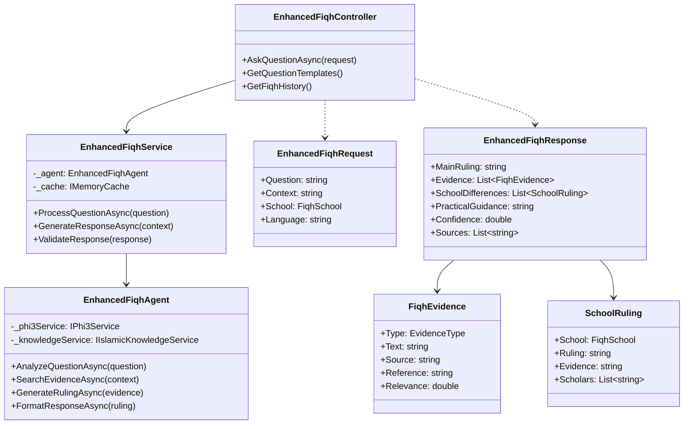

### Flux de Données Enhanced Fiqh

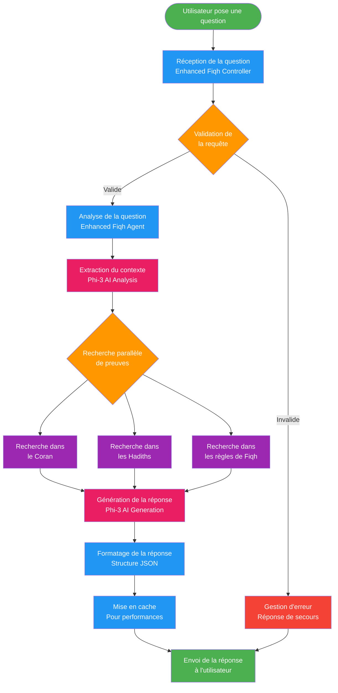

### Intégration AI/ML dans Enhanced Fiqh

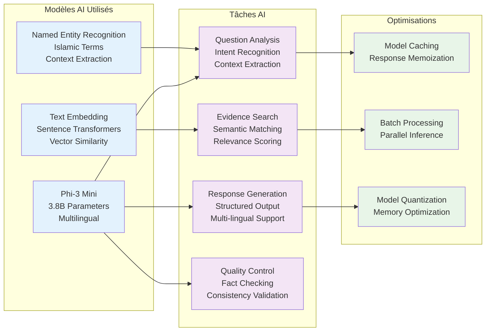

### Métriques et Monitoring Enhanced Fiqh

```mermaid
graph TB
    subgraph "Métriques de Performance"
        RESPONSE_TIME[Temps de Réponse<br/>Objectif: < 3 secondes]
        ACCURACY[Précision des Réponses<br/>Objectif: > 95%]
        COVERAGE[Couverture des Sujets<br/>Objectif: 90% domaines fiqh]
        USER_SATISFACTION[Satisfaction Utilisateur<br/>Objectif: > 4.5/5]
    end

    subgraph "Métriques Techniques"
        AI_LATENCY[Latence IA<br/>Phi-3 Processing Time]
        SEARCH_EFFICIENCY[Efficacité Recherche<br/>Vector Search Performance]
        CACHE_HIT_RATE[Taux de Cache Hit<br/>Response Caching]
        ERROR_RATE[Taux d'Erreur<br/>System Reliability]
    end

    subgraph "Monitoring Tools"
        LOGS[Application Logs<br/>Structured Logging]
        METRICS[Metrics Collection<br/>Prometheus/Grafana]
        ALERTS[Alert System<br/>Automated Notifications]
        DASHBOARD[Monitoring Dashboard<br/>Real-time Insights]
    end

    RESPONSE_TIME --> LOGS
    ACCURACY --> METRICS
    COVERAGE --> DASHBOARD
    USER_SATISFACTION --> ALERTS
    
    AI_LATENCY --> LOGS
    SEARCH_EFFICIENCY --> METRICS
    CACHE_HIT_RATE --> DASHBOARD
    ERROR_RATE --> ALERTS

    %% Styling
    classDef performance fill:#4caf50
    classDef technical fill:#2196f3
    classDef monitoring fill:#ff9800
    
    class RESPONSE_TIME,ACCURACY,COVERAGE,USER_SATISFACTION performance
    class AI_LATENCY,SEARCH_EFFICIENCY,CACHE_HIT_RATE,ERROR_RATE technical
    class LOGS,METRICS,ALERTS,DASHBOARD monitoring
```

### Roadmap Enhanced Fiqh

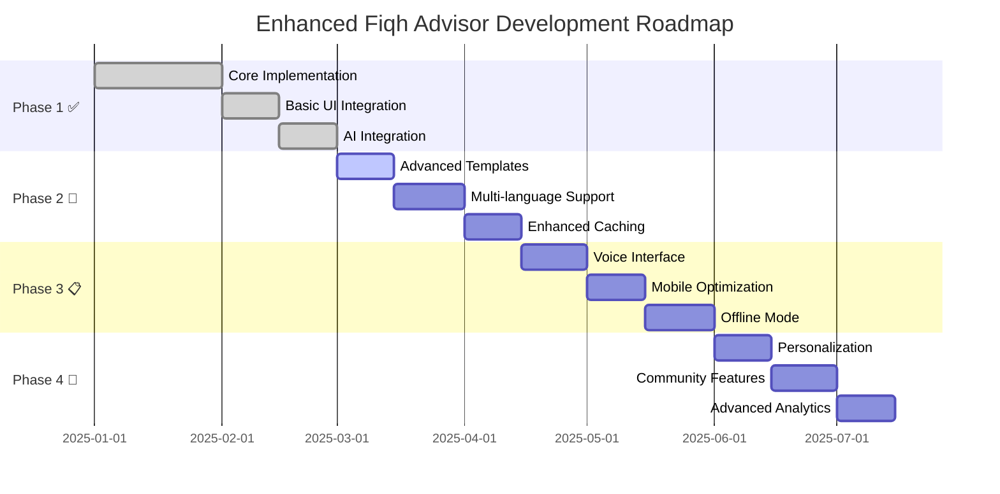
