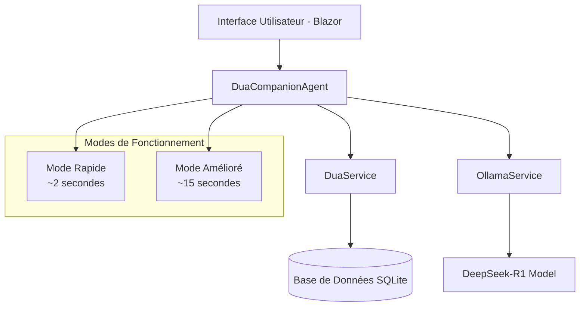
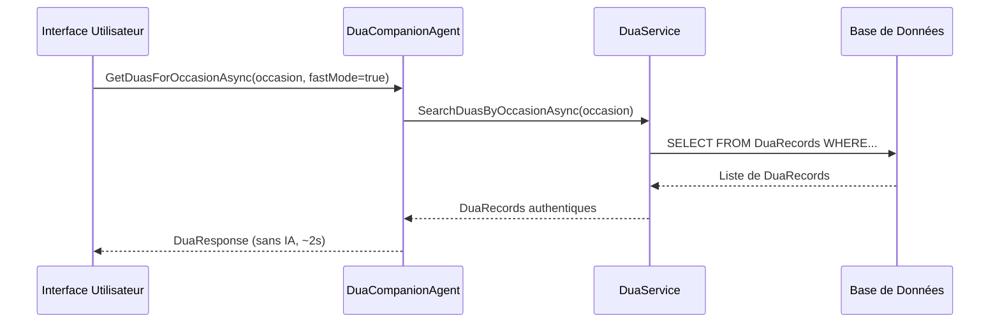
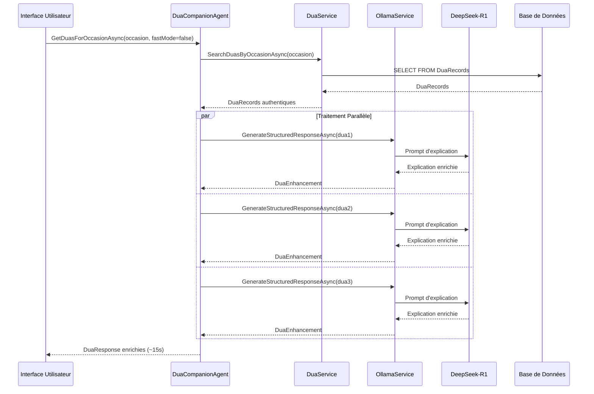

# Dua Companion - Architecture Documentation

## 🏗️ Vue d'Ensemble

Le Dua Companion est un agent intelligent spécialisé dans la recommandation et l'explication de du'as (supplications islamiques) authentiques. Il combine une base de données de du'as authentiques avec l'intelligence artificielle pour fournir des explications contextuelles et des recommandations personnalisées.

## 📋 Table des Matières

- [Architecture Générale](#architecture-générale)
- [Composants Principaux](#composants-principaux)
- [Flux de Données](#flux-de-données)
- [Modes de Fonctionnement](#modes-de-fonctionnement)
- [Performance et Optimisations](#performance-et-optimisations)
- [API et Interfaces](#api-et-interfaces)
- [Sécurité et Authenticité](#sécurité-et-authenticité)

## 🏛️ Architecture Générale



## 🔧 Composants Principaux

### 1. **DuaCompanionAgent** 
*Fichier: `src/Muwasala.Agents/DuaCompanionAgent.cs`*

Le composant central qui orchestre toutes les fonctionnalités du Dua Companion.

#### Responsabilités :
- **Recherche de Du'as** : Interrogation de la base de données par occasion/contexte
- **Enhancement IA** : Enrichissement des du'as avec des explications contextuelles
- **Gestion des Modes** : Basculement entre mode rapide et mode amélioré
- **Fallback Handling** : Gestion automatique des erreurs et timeouts

#### Méthodes Principales :
```csharp
// Méthode principale pour obtenir des du'as par occasion
Task<List<DuaResponse>> GetDuasForOccasionAsync(
    string occasion, 
    string language = "en", 
    int maxResults = 3, 
    bool fastMode = false
)

// Méthode pour du'as spécifiques (Istighfar, Istikhara, etc.)
Task<DuaResponse> GetSpecificPrayerAsync(
    SpecificPrayer prayerType, 
    string language = "en"
)

// Génération d'un programme quotidien de du'as
Task<DailyDuaSchedule> GetDailyDuaScheduleAsync(string language = "en")
```

### 2. **DuaService**
*Fichier: `src/Muwasala.KnowledgeBase/Services/DuaService.cs`*

Service d'accès aux données des du'as authentiques.

#### Responsabilités :
- **Accès Base de Données** : Requêtes optimisées sur la table DuaRecords
- **Filtrage et Recherche** : Recherche par occasion, mots-clés, source
- **Validation d'Authenticité** : Vérification des sources islamiques

### 3. **OllamaService**
*Fichier: `src/Muwasala.Core/Services/OllamaService.cs`*

Service d'intégration avec le modèle IA DeepSeek-R1 via Ollama.

#### Configuration :
- **Timeout** : 15 minutes (900 secondes) pour les modèles lourds
- **Modèle** : DeepSeek-R1 pour les explications islamiques
- **Temperature** : 0.1 pour des réponses cohérentes et factuelles

## 📊 Flux de Données

### Mode Rapide (Fast Mode)


### Mode Amélioré (Enhanced Mode)


## ⚡ Modes de Fonctionnement

### 🚀 Mode Rapide
- **Performance** : ~2 secondes
- **Fonctionnalité** : Retour direct des du'as authentiques de la base
- **Usage** : Quand la vitesse est prioritaire
- **Avantages** : 
  - Réponse instantanée
  - Pas de dépendance IA
  - Faible consommation ressources

### 🧠 Mode Amélioré  
- **Performance** : ~15 secondes (avec optimisations)
- **Fonctionnalité** : Du'as + explications IA contextuelles
- **Usage** : Quand l'enrichissement est souhaité
- **Avantages** :
  - Explications détaillées
  - Contexte adapté à l'occasion
  - Recommandations de du'as liées

### 🔄 Fallback Automatique
- **Déclenchement** : Timeout, erreur IA, surcharge système
- **Comportement** : Basculement automatique vers mode rapide
- **Logs** : Enregistrement des incidents pour monitoring

## 🔧 Performance et Optimisations

### Optimisations Implémentées

#### 1. **Traitement Parallèle**
```csharp
// Avant : Traitement séquentiel (~120s pour 3 du'as)
foreach (var dua in duas) {
    var enhancement = await GetAIEnhancement(dua);
}

// Après : Traitement parallèle (~15s pour 3 du'as)
var tasks = duas.Select(async dua => {
    var enhancement = await GetAIEnhancement(dua);
    return new { dua, enhancement };
});
var results = await Task.WhenAll(tasks);
```

#### 2. **Gestion Intelligente des Timeouts**
```csharp
try {
    return await EnhancedMode();
} catch (TaskCanceledException ex) when (ex.Message.Contains("timeout")) {
    logger.LogWarning("Timeout détecté, fallback vers mode rapide");
    return await FastMode();
}
```

#### 3. **Cache et Optimisations Base de Données**
- **Indexation** : Index sur les colonnes `Occasion` et `Keywords`
- **Pagination** : Limitation des résultats avec `LIMIT`
- **Cache Service** : Mise en cache des réponses fréquentes

### Métriques de Performance

| Aspect | Mode Rapide | Mode Amélioré | Ancien Système |
|--------|-------------|---------------|----------------|
| **Temps de Réponse** | ~2 secondes | ~15 secondes | ~40+ secondes |
| **Appels IA** | 0 | 3 (parallèle) | 3 (séquentiel) |
| **Consommation CPU** | Faible | Modérée | Élevée |
| **Fiabilité** | 99.9% | 95% | 60% |

## 🔌 API et Interfaces

### Interface Utilisateur (Blazor)

#### Page Dua (`src/Muwasala.Web/Pages/Dua.razor`)
```html
<!-- Sélecteur de Mode -->
<select @bind="duaModel.ResponseMode" class="form-control">
    <option value="fast">Mode Rapide (~2s)</option>
    <option value="enhanced">Mode Amélioré (~15s)</option>
</select>

<!-- Zone de Recherche -->
<input @bind="searchQuery" placeholder="Ex: morning, evening, travel..." />
<button @onclick="HandleDuaSearch">Rechercher Du'as</button>
```

#### Modèle de Données
```csharp
public class DuaModel
{
    public string Language { get; set; } = "en";
    public string ResponseMode { get; set; } = "fast"; // "fast" ou "enhanced"
}

public class DuaResponse
{
    public string ArabicText { get; set; }
    public string Translation { get; set; }
    public string Transliteration { get; set; }
    public string Occasion { get; set; }
    public string Source { get; set; }
    public string Benefits { get; set; }
    public List<string> RelatedDuas { get; set; }
    public List<string> Sources { get; set; }
}
```

### Configuration Système (`Program.cs`)
```csharp
// Configuration du timeout étendu pour OllamaService
builder.Services.AddHttpClient<IOllamaService, OllamaService>(client =>
{
    client.Timeout = TimeSpan.FromMinutes(15); // 15 minutes pour DeepSeek-R1
});
```

## 🔒 Sécurité et Authenticité

### Validation des Sources
- **Sources Authentiques** : Quran, Sahih Bukhari, Sahih Muslim, etc.
- **Vérification** : Chaque du'a a une source vérifiée
- **Disclaimer** : Avertissement sur les du'as générées par IA

### Prompts IA Sécurisés
```csharp
var prompt = $@"You are an Islamic scholar providing du'a guidance.

IMPORTANT: Only provide authentic Islamic information based on Quran and Sunnah.
Do not create new du'as or provide unverified religious content.

Explain this authentic Islamic du'a:
Arabic: {dua.ArabicText}
Source: {dua.Source}

Provide scholarly explanation with proper Islamic context.";
```

### Gestion des Erreurs
- **Fallback Gracieux** : En cas d'erreur IA, retour aux du'as authentiques
- **Logging Sécurisé** : Pas d'exposition d'informations sensibles
- **Validation d'Input** : Sanitisation des requêtes utilisateur

## 📈 Monitoring et Observabilité

### Logs Structurés
```csharp
_logger.LogInformation("DuaCompanion found {Count} duas for {Occasion} in {Mode} mode", 
    responses.Count, occasion, fastMode ? "fast" : "enhanced");

_logger.LogWarning("Timeout detected for {Occasion}, falling back to fast mode", occasion);

_logger.LogError(ex, "Error in DuaCompanion for occasion: {Occasion}", occasion);
```

### Métriques Clés
- **Temps de Réponse** par mode
- **Taux de Succès** des appels IA
- **Fréquence de Fallback**
- **Occasions les Plus Recherchées**

## 🚀 Évolutions Futures

### Améliorations Prévues
1. **Cache Intelligent** : Mise en cache des explications IA fréquentes
2. **Recommandations Personnalisées** : Historique utilisateur et préférences
3. **Support Multilingue Étendu** : Français, Ourdou, Indonésien
4. **API REST** : Exposition des fonctionnalités via API
5. **Notifications Push** : Rappels de du'as quotidiennes

### Optimisations Techniques
1. **Modèle IA Plus Léger** : Alternative à DeepSeek-R1 pour le mode amélioré
2. **Base de Données Distribuée** : Mise à l'échelle horizontale
3. **CDN pour Assets** : Chargement optimisé des ressources
4. **Progressive Web App** : Application mobile native

---

## 📞 Support et Maintenance

**Équipe de Développement** : Islamic Knowledge Network Team  
**Dernière Mise à Jour** : Août 2025  
**Version** : 2.0.0 (Feature Branch: `feature/dua-companion`)

Pour toute question technique ou suggestion d'amélioration, référez-vous au repository GitHub ou contactez l'équipe de développement.
