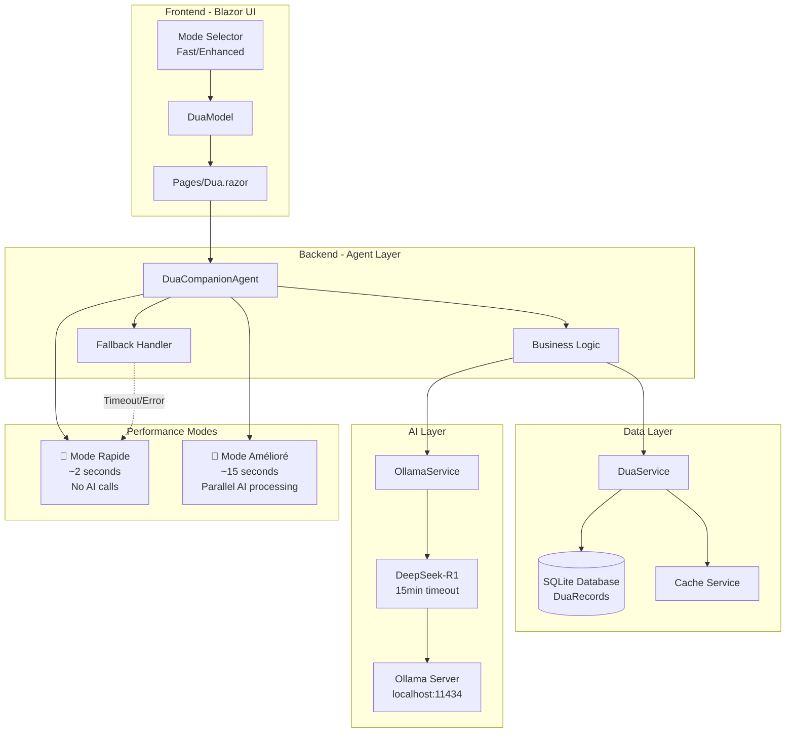
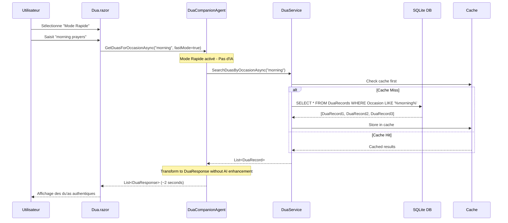
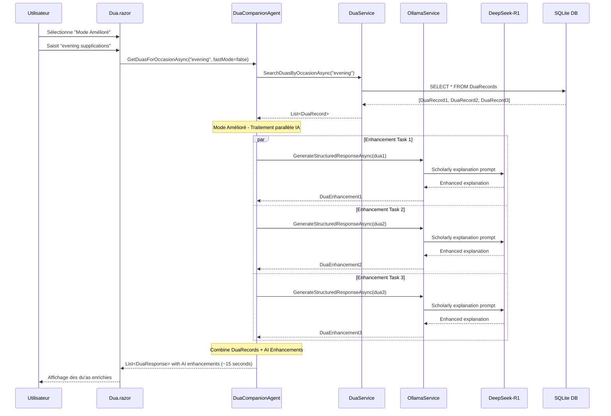
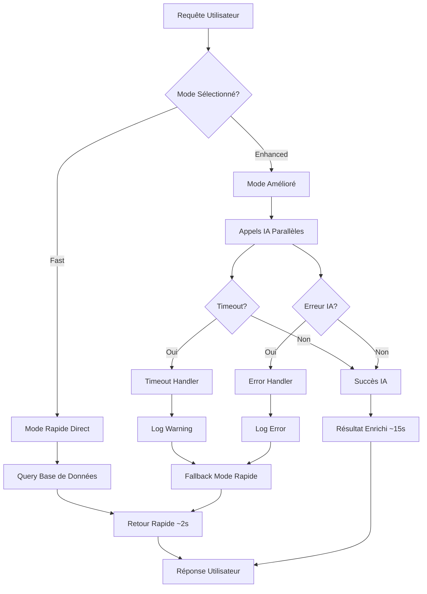
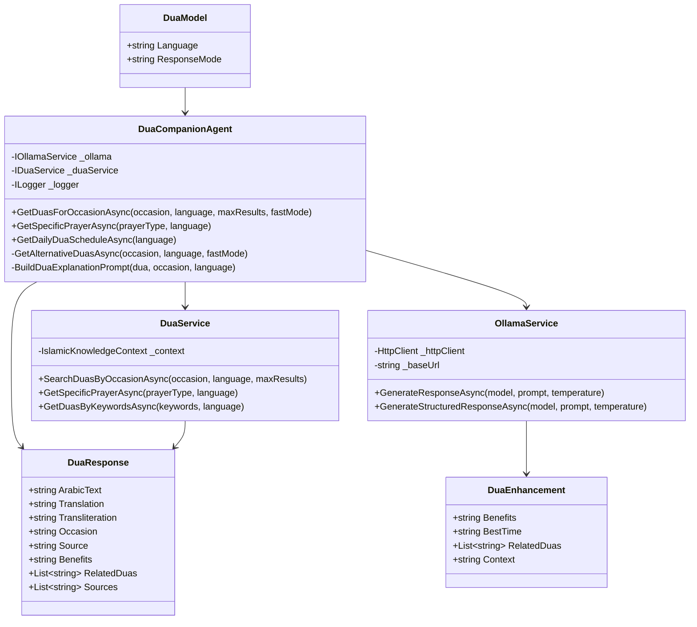
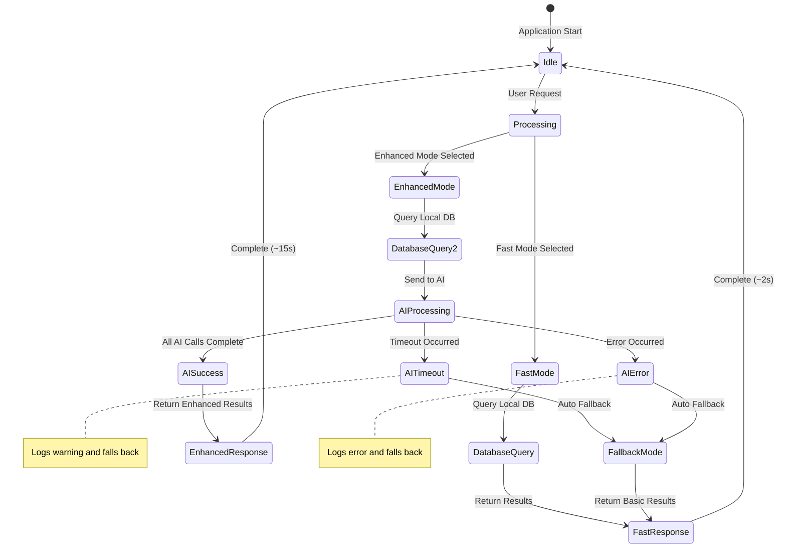

# Dua Companion - Diagrammes d'Architecture

## 🏗️ Architecture Système Complète



## 🔄 Flux de Données - Mode Rapide



## 🧠 Flux de Données - Mode Amélioré



## ⚠️ Gestion d'Erreurs et Fallback



## 🔧 Architecture des Composants



## 📊 Métriques de Performance

```mermaid
gantt
    title Timeline de Performance - Dua Companion
    dateFormat X
    axisFormat %s
    
    section Mode Rapide
    Query DB           :active, fast-db, 0, 1s
    Transform Data     :active, fast-transform, 1s, 2s
    
    section Mode Amélioré (Avant)
    Query DB           :done, old-db, 0, 1s
    AI Call 1          :done, old-ai1, 1s, 41s
    AI Call 2          :done, old-ai2, 41s, 81s
    AI Call 3          :done, old-ai3, 81s, 121s
    
    section Mode Amélioré (Optimisé)
    Query DB           :active, new-db, 0, 1s
    Parallel AI Call 1 :active, new-ai1, 1s, 15s
    Parallel AI Call 2 :active, new-ai2, 1s, 15s
    Parallel AI Call 3 :active, new-ai3, 1s, 15s
```

## 🔄 États du Système



---

*Dernière mise à jour : Août 2025*  
*Version : 2.0.0 - Feature Branch: feature/dua-companion*
