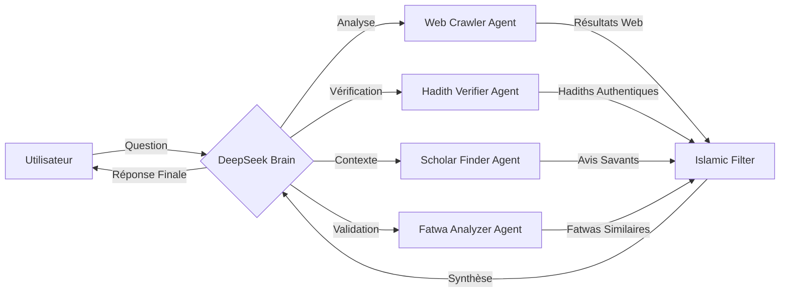

# 🧠 Architecture Multi-Agents avec DeepSeek

## Vue d'ensemble
Integration d'un système multi-agents avec DeepSeek comme cerveau central pour la recherche web et l'analyse islamique.

## Architecture Proposée



## Agents Spécialisés

### 1. WebCrawlerAgent
```csharp
public class WebCrawlerAgent : ISpecializedAgent
{
    public async Task<SearchResult[]> SearchIslamicSources(string query)
    {
        var trustedSources = new[]
        {
            "islamqa.org",
            "dar-alifta.org", 
            "sunnah.com",
            "islamicfinder.org"
        };
        
        return await SearchMultipleSources(query, trustedSources);
    }
}
```

### 2. HadithVerifierAgent
```csharp
public class HadithVerifierAgent : ISpecializedAgent
{
    public async Task<HadithVerification> VerifyHadith(string hadithText)
    {
        // Vérification dans Sunnah.com API
        // Classification: Sahih, Hassan, Daif
        // Sources: Bukhari, Muslim, etc.
    }
}
```

### 3. ScholarFinderAgent
```csharp
public class ScholarFinderAgent : ISpecializedAgent
{
    public async Task<ScholarOpinion[]> FindScholarlyOpinions(string topic)
    {
        // Recherche d'avis de savants reconnus
        // Sources: Al-Azhar, Dar al-Ifta, etc.
    }
}
```

### 4. FatwaAnalyzerAgent
```csharp
public class FatwaAnalyzerAgent : ISpecializedAgent
{
    public async Task<FatwaComparison> AnalyzeSimilarFatwas(string question)
    {
        // Comparaison avec fatwas existantes
        // Détection de consensus ou divergences
    }
}
```

## DeepSeek Brain Central

```csharp
public class DeepSeekBrainService
{
    private readonly OllamaService _ollama;
    private readonly Dictionary<string, ISpecializedAgent> _agents;
    
    public async Task<IslamicKnowledgeResponse> ProcessIntelligentQuery(string query)
    {
        // Phase 1: Analyse initiale
        var analysisPrompt = $"""
        [QUERY] {query}
        [TASK] Détermine quels agents spécialisés activer:
        - WebCrawler: Pour recherche web générale
        - HadithVerifier: Si hadiths mentionnés
        - ScholarFinder: Pour avis savants
        - FatwaAnalyzer: Pour questions de fiqh
        
        [OUTPUT] JSON avec agents nécessaires et requêtes spécifiques
        """;
        
        var analysis = await _ollama.GenerateAsync("deepseek-coder", analysisPrompt);
        var agentPlan = JsonSerializer.Deserialize<AgentExecutionPlan>(analysis);
        
        // Phase 2: Exécution des agents
        var agentResults = await ExecuteAgentsAsync(agentPlan);
        
        // Phase 3: Synthèse finale
        var synthesisPrompt = $"""
        [QUESTION ORIGINALE] {query}
        
        [DONNÉES COLLECTÉES]
        {FormatAgentResults(agentResults)}
        
        [INSTRUCTIONS]
        1. Synthétise une réponse complète en français
        2. Cite toutes les sources avec URLs
        3. Structure: Explication → Preuves → Recommandations
        4. Applique le filtrage islamique
        """;
        
        var finalResponse = await _ollama.GenerateAsync("deepseek-coder", synthesisPrompt);
        
        return CreateStructuredResponse(finalResponse, agentResults);
    }
}
```

## Filtrage Islamique

```csharp
public class IslamicContentFilter
{
    private readonly string[] _forbiddenTopics = 
    {
        "magie noire", "sorcellerie", "innovation blâmable",
        "pratiques non-islamiques", "superstitions"
    };
    
    public ValidationResult ValidateQuery(string query)
    {
        // Vérification avec modèle léger
        if (_forbiddenTopics.Any(t => query.Contains(t, StringComparison.OrdinalIgnoreCase)))
        {
            return ValidationResult.Forbidden("Sujet non autorisé en Islam");
        }
        
        return ValidationResult.Approved();
    }
    
    public string FilterResponse(string response)
    {
        // Application de filtres de contenu islamique
        return ApplyIslamicGuidelines(response);
    }
}
```

## Sources Islamiques Prioritaires

```csharp
public class TrustedIslamicSources
{
    public static readonly Dictionary<string, int> SourcePriority = new()
    {
        ["quran.com"] = 100,
        ["sunnah.com"] = 95,
        ["islamqa.org"] = 90,
        ["dar-alifta.org"] = 90,
        ["islamicfinder.org"] = 85,
        ["al-islam.org"] = 80
    };
}
```

## Implémentation Progressive

### Étape 1: Intégration DeepSeek
1. Installation: `ollama pull deepseek-coder:1.3b`
2. Configuration du service DeepSeek
3. Test avec requêtes simples

### Étape 2: Agents Spécialisés  
1. WebCrawlerAgent (extension de l'existant)
2. HadithVerifierAgent
3. IslamicContentFilter

### Étape 3: Orchestration
1. DeepSeekBrainService
2. Logique de décision multi-agents
3. Interface utilisateur enrichie

## Avantages

✅ **Intelligence Distribuée**: Chaque agent expert dans son domaine
✅ **Filtrage Éthique**: Validation islamique à chaque étape  
✅ **Sources Fiables**: Priorisation des références authentiques
✅ **Économie de Ressources**: Activation sélective des agents
✅ **Traçabilité**: Journalisation complète des sources

## Configuration Matérielle Recommandée

- **RAM**: 16GB minimum pour DeepSeek + agents
- **GPU**: RTX 4060+ pour performance optimale
- **Stockage**: 50GB pour modèles et cache
