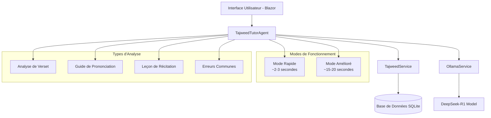
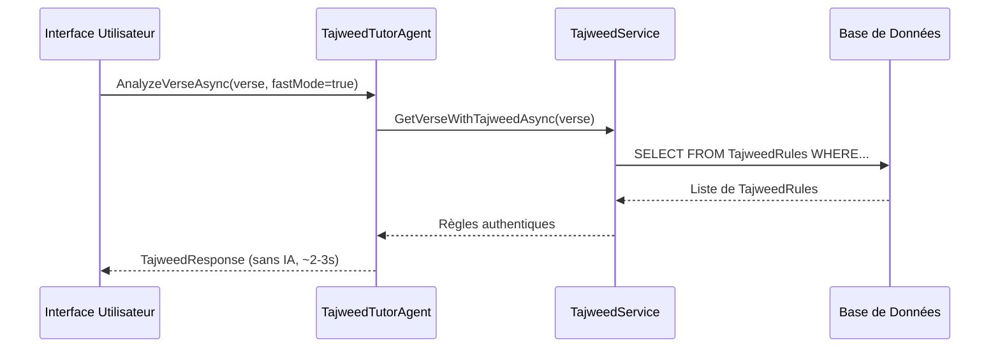
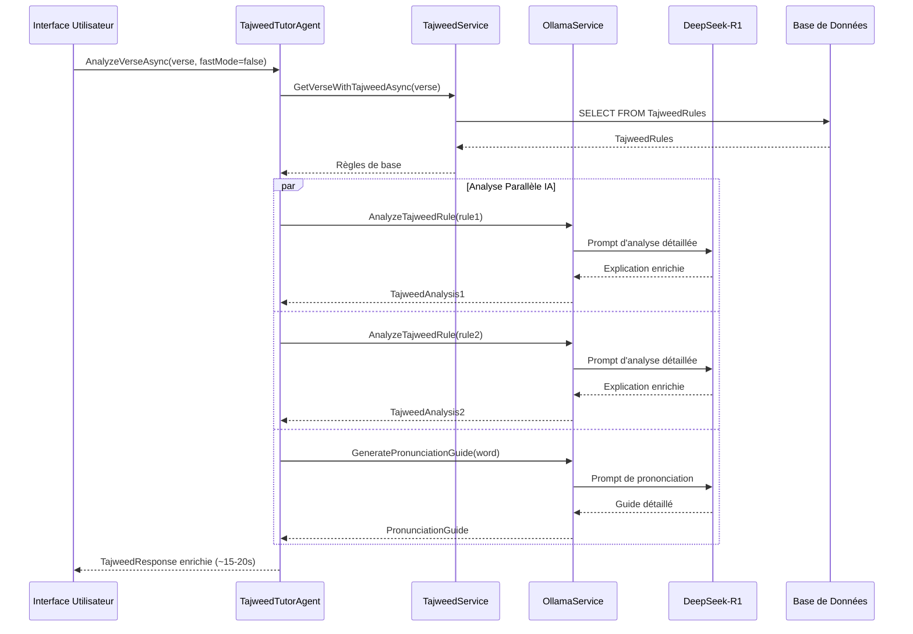

# Tajweed Tutor - Architecture Documentation

## 🏗️ Vue d'Ensemble

Le Tajweed Tutor est un agent intelligent spécialisé dans l'enseignement des règles de Tajweed et la correction de la récitation coranique. Il combine une base de données de règles de Tajweed authentiques avec l'intelligence artificielle pour fournir des analyses détaillées, des guides de prononciation et des leçons interactives.

## 📋 Table des Matières

- [Architecture Générale](#architecture-générale)
- [Composants Principaux](#composants-principaux)
- [Flux de Données](#flux-de-données)
- [Modes de Fonctionnement](#modes-de-fonctionnement)
- [Performance et Optimisations](#performance-et-optimisations)
- [API et Interfaces](#api-et-interfaces)
- [Règles de Tajweed](#règles-de-tajweed)

## 🏛️ Architecture Générale



## 🔧 Composants Principaux

### 1. **TajweedTutorAgent** 
*Fichier: `src/Muwasala.Agents/TajweedTutorAgent.cs`*

Le composant central qui orchestre toutes les fonctionnalités du Tajweed Tutor.

#### Responsabilités :
- **Analyse de Versets** : Identification des règles de Tajweed dans les versets coraniques
- **Guide de Prononciation** : Instructions détaillées pour la prononciation correcte
- **Leçons Interactives** : Création de leçons progressives adaptées au niveau
- **Détection d'Erreurs** : Identification des erreurs communes de récitation

#### Méthodes Principales :
```csharp
// Analyse des règles de Tajweed pour un verset
Task<TajweedResponse> AnalyzeVerseAsync(
    VerseReference verse, 
    string language = "en",
    bool fastMode = false
)

// Guide de prononciation pour un mot difficile
Task<PronunciationGuide> GetPronunciationGuideAsync(
    string arabicWord, 
    string language = "en",
    bool fastMode = false
)

// Leçon de récitation interactive pour une sourate
Task<RecitationLesson> CreateRecitationLessonAsync(
    int surahNumber, 
    RecitationLevel level = RecitationLevel.Beginner,
    bool fastMode = false
)

// Analyse des erreurs communes de récitation
Task<List<CommonMistake>> GetCommonMistakesAsync(
    string recitationType,
    string language = "en"
)
```

### 2. **TajweedService**
*Fichier: `src/Muwasala.KnowledgeBase/Services/TajweedService.cs`*

Service d'accès aux données des règles de Tajweed authentiques.

#### Responsabilités :
- **Accès Base de Données** : Requêtes optimisées sur la table TajweedRules
- **Filtrage par Règles** : Recherche par type de règle, difficulté, position
- **Validation Authentique** : Vérification des règles selon les savants reconnus

### 3. **OllamaService**
*Fichier: `src/Muwasala.Core/Services/OllamaService.cs`*

Service d'intégration avec le modèle IA DeepSeek-R1 pour l'analyse avancée.

#### Configuration :
- **Timeout** : 20 minutes (1200 secondes) pour les analyses complexes
- **Modèle** : DeepSeek-R1 pour les explications détaillées de Tajweed
- **Temperature** : 0.2 pour des réponses précises et cohérentes

## 📊 Flux de Données

### Mode Rapide (Fast Mode)


### Mode Amélioré (Enhanced Mode)


## ⚡ Modes de Fonctionnement

### 🚀 Mode Rapide
- **Performance** : ~2-3 secondes
- **Fonctionnalité** : Règles de Tajweed de base depuis la base de données
- **Usage** : Référence rapide, révision, consultation immédiate
- **Avantages** : 
  - Réponse instantanée
  - Pas de dépendance IA
  - Règles authentiques vérifiées
  - Faible consommation ressources

### 🧠 Mode Amélioré  
- **Performance** : ~15-20 secondes (avec optimisations)
- **Fonctionnalité** : Règles + analyses IA détaillées + guides interactifs
- **Usage** : Apprentissage approfondi, leçons détaillées
- **Avantages** :
  - Explications contextuelles détaillées
  - Exemples adaptés au niveau de l'utilisateur
  - Guides de prononciation personnalisés
  - Détection d'erreurs communes

### 🔄 Fallback Automatique
- **Déclenchement** : Timeout IA, erreur de modèle, surcharge système
- **Comportement** : Basculement automatique vers mode rapide
- **Logs** : Enregistrement détaillé pour monitoring et debugging

## 🔧 Performance et Optimisations

### Problèmes Actuels Identifiés
- **Timeout Fréquents** : Réponses de 60-100+ secondes (inacceptable)
- **Analyse Séquentielle** : Une règle analysée à la fois
- **Pas de Cache** : Réanalyse répétée des mêmes versets
- **Interface Limitée** : Pas de sélection de mode

### Optimisations Prévues

#### 1. **Traitement Parallèle des Règles**
```csharp
// Avant : Analyse séquentielle (3-4 minutes pour un verset complet)
foreach (var rule in tajweedRules) {
    var analysis = await GetAIAnalysis(rule);
}

// Après : Traitement parallèle (~15-20s pour un verset complet)
var tasks = tajweedRules.Select(async rule => {
    var analysis = await GetAIAnalysis(rule);
    return new { rule, analysis };
});
var results = await Task.WhenAll(tasks);
```

#### 2. **Cache Intelligent des Analyses**
```csharp
// Cache des analyses de versets fréquemment consultés
var cacheKey = $"tajweed-{verse.Surah}-{verse.Ayah}-{language}";
if (cache.TryGetValue(cacheKey, out TajweedResponse cached)) {
    return cached;
}
```

#### 3. **Gestion Robuste des Timeouts**
```csharp
try {
    return await EnhancedTajweedAnalysis();
} catch (TaskCanceledException ex) when (ex.Message.Contains("timeout")) {
    logger.LogWarning("Timeout détecté, fallback vers mode rapide");
    return await FastTajweedAnalysis();
}
```

### Métriques de Performance Cibles

| Aspect | Mode Rapide | Mode Amélioré | Système Actuel |
|--------|-------------|---------------|----------------|
| **Temps de Réponse** | ~2-3 secondes | ~15-20 secondes | ~60-100+ secondes |
| **Appels IA** | 0 | 3-5 (parallèle) | 3-5 (séquentiel) |
| **Fiabilité** | 99.9% | 95% | 40-50% |
| **Cache Hit Rate** | N/A | 70-80% | 0% |

## 🔌 API et Interfaces

### Interface Utilisateur (Blazor)

#### Page Tajweed (`src/Muwasala.Web/Pages/Tajweed.razor`)
```html
<!-- Sélecteur de Mode Performance -->
<div class="mb-3">
    <label class="form-label">Mode de Performance</label>
    <select @bind="tajweedModel.ResponseMode" class="form-control">
        <option value="fast">Mode Rapide (~2-3s) - Règles de base</option>
        <option value="enhanced">Mode Amélioré (~15-20s) - Analyse IA détaillée</option>
    </select>
</div>

<!-- Sélecteur de Type d'Analyse -->
<div class="mb-3">
    <label class="form-label">Type d'Analyse</label>
    <select @bind="tajweedModel.LearningType" class="form-control">
        <option value="analysis">Analyse de Verset</option>
        <option value="pronunciation">Guide de Prononciation</option>
        <option value="lesson">Leçon de Récitation</option>
        <option value="mistakes">Erreurs Communes</option>
    </select>
</div>
```

#### Modèle de Données
```csharp
public class TajweedModel
{
    public string LearningType { get; set; } = "analysis";
    public string ResponseMode { get; set; } = "fast"; // "fast" ou "enhanced"
    public int Surah { get; set; } = 1;
    public int Ayah { get; set; } = 1;
    public string Language { get; set; } = "en";
    public RecitationLevel Level { get; set; } = RecitationLevel.Beginner;
}

public class TajweedResponse
{
    public string VerseText { get; set; }
    public List<TajweedRule> Rules { get; set; }
    public string AudioExample { get; set; }
    public string PronunciationGuide { get; set; }
    public List<string> Sources { get; set; }
}
```

### Configuration Système (`Program.cs`)
```csharp
// Configuration timeout étendu spécifique pour Tajweed
builder.Services.AddHttpClient<ITajweedTutorAgent, TajweedTutorAgent>(client =>
{
    client.Timeout = TimeSpan.FromMinutes(20); // 20 minutes pour analyses complexes
});
```

## 📚 Règles de Tajweed

### Base de Données des Règles

#### Catégories Principales :
1. **Nun Sakinah et Tanween** : Ikhfa, Idgham, Iqlab, Izhar
2. **Meem Sakinah** : Ikhfa Shafawi, Idgham Shafawi, Izhar Shafawi
3. **Qalqalah** : Qalqalah Sughra et Kubra
4. **Madd** : Madd Tabi'i, Madd Munfasil, Madd Muttasil
5. **Lam Sakinah** : Tarqeeq et Tafkheem
6. **Ra** : Tarqeeq et Tafkheem

#### Structure des Données :
```csharp
public class TajweedRule
{
    public string Name { get; set; }
    public string Category { get; set; }
    public string Description { get; set; }
    public int StartPosition { get; set; }
    public int EndPosition { get; set; }
    public string AffectedText { get; set; }
    public string ColorCode { get; set; } // Pour la visualisation
    public List<string> Examples { get; set; }
    public string AudioUrl { get; set; }
}
```

### Visualisation Interactive

#### Codes Couleur Standards :
- **Rouge** : Qalqalah
- **Vert** : Idgham avec Ghunnah
- **Bleu** : Ikhfa
- **Jaune** : Madd
- **Orange** : Iqlab
- **Violet** : Tafkheem

## 🎯 Fonctionnalités Avancées Prévues

### 1. **Reconnaissance Vocale**
```csharp
public async Task<RecitationFeedback> AnalyzeUserRecitationAsync(
    byte[] audioData,
    VerseReference expectedVerse,
    string language = "en"
)
```

### 2. **Progression Tracking**
```csharp
public class UserProgress
{
    public string UserId { get; set; }
    public List<CompletedLesson> Lessons { get; set; }
    public Dictionary<string, int> RuleMastery { get; set; }
    public RecitationLevel CurrentLevel { get; set; }
}
```

### 3. **Audio Intégré**
```html
<audio controls>
    <source src="@tajweedResponse.AudioExample" type="audio/mpeg">
    Exemple audio de récitation
</audio>
```

## 📈 Monitoring et Observabilité

### Logs Structurés
```csharp
_logger.LogInformation("TajweedTutor analyzed verse {Surah}:{Ayah} with {RuleCount} rules in {Mode} mode", 
    verse.Surah, verse.Ayah, response.Rules.Count, fastMode ? "fast" : "enhanced");

_logger.LogWarning("Timeout detected for verse {Verse}, falling back to fast mode", verse);

_logger.LogError(ex, "Error in TajweedTutor for verse: {Verse}", verse);
```

### Métriques Clés
- **Temps d'Analyse** par type et mode
- **Taux de Succès** des analyses IA
- **Versets les Plus Consultés**
- **Règles les Plus Difficiles**
- **Progression Utilisateurs**

## 🚀 Évolutions Futures

### Phase 1 : Optimisation Performance (Immédiate)
1. **Mode Rapide/Amélioré** : Implémentation du système dual
2. **Traitement Parallèle** : Analyse simultanée des règles
3. **Cache Intelligent** : Stockage des analyses fréquentes
4. **Interface Améliorée** : Sélecteurs de mode et visualisation

### Phase 2 : Fonctionnalités Avancées
1. **Audio Intégré** : Exemples de récitation pour chaque règle
2. **Reconnaissance Vocale** : Feedback en temps réel
3. **Leçons Interactives** : Parcours d'apprentissage progressif
4. **Communauté** : Partage et évaluation par les pairs

### Phase 3 : Intelligence Avancée
1. **IA Spécialisée** : Modèle dédié aux règles de Tajweed
2. **Analyse Contextuelle** : Règles adaptées au contexte du verset
3. **Personnalisation** : Leçons adaptées aux difficultés individuelles
4. **Certification** : Système d'évaluation et de certification

---

## 📞 Support et Maintenance

**Équipe de Développement** : Islamic Knowledge Network Team  
**Dernière Mise à Jour** : Août 2025  
**Version** : 1.0.0 (Feature Branch: `feature/tajweed-enhancement`)

Pour toute question technique ou suggestion d'amélioration, référez-vous au repository GitHub ou contactez l'équipe de développement.
