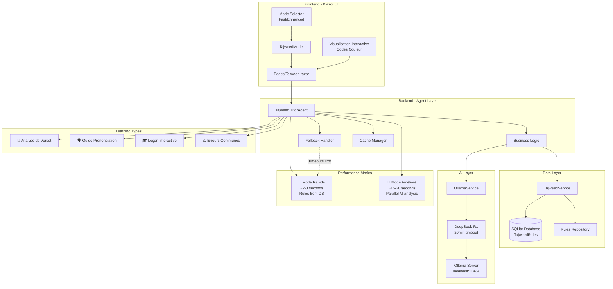
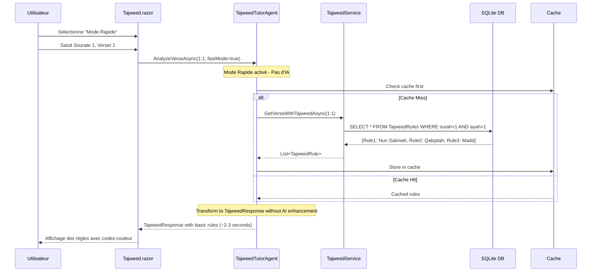
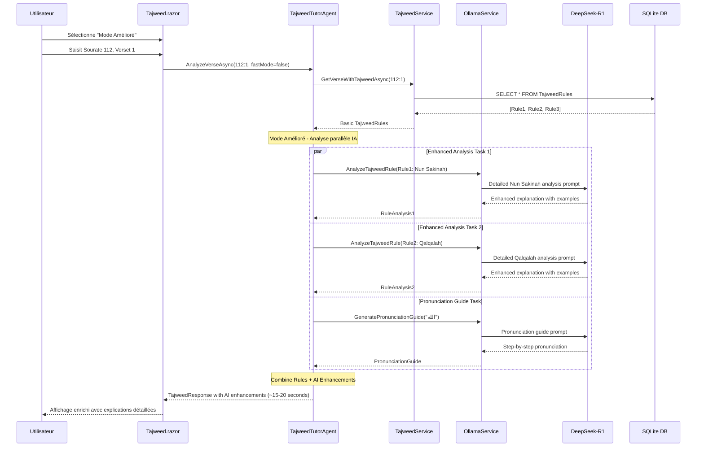
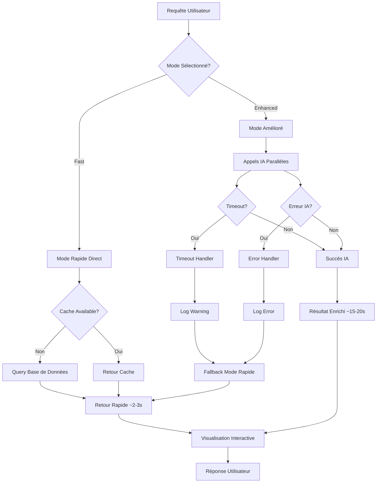
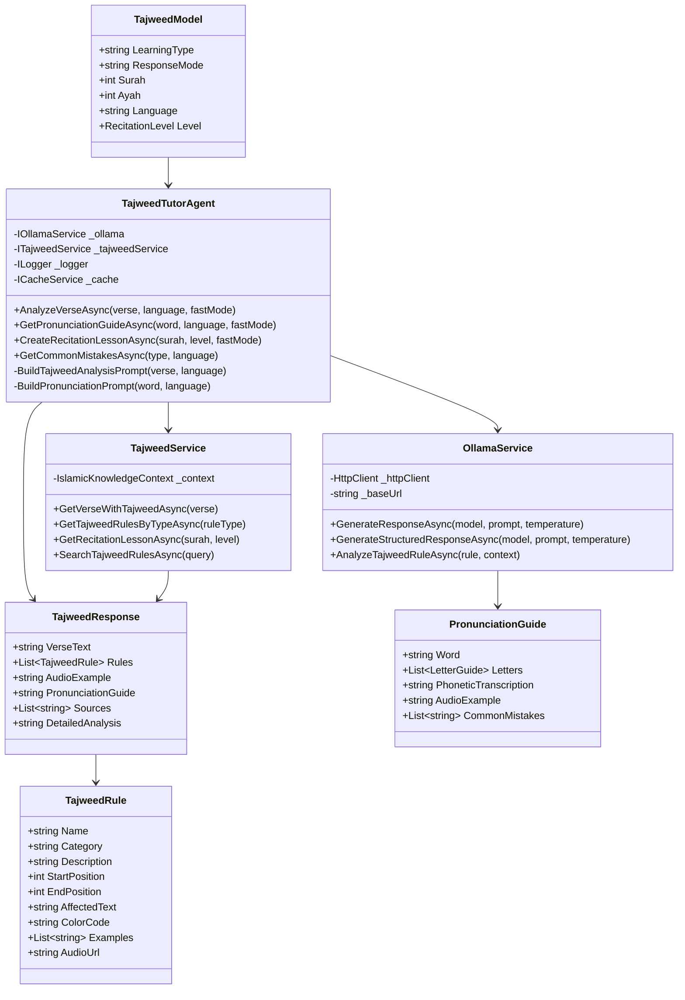
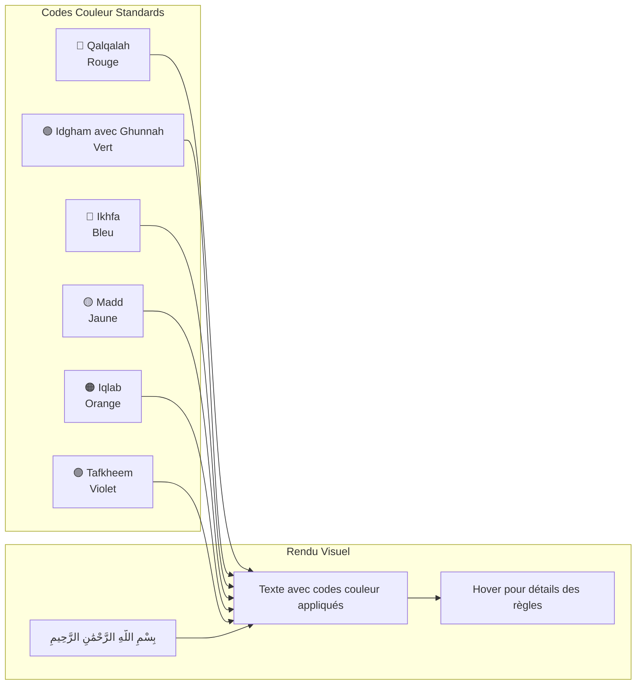
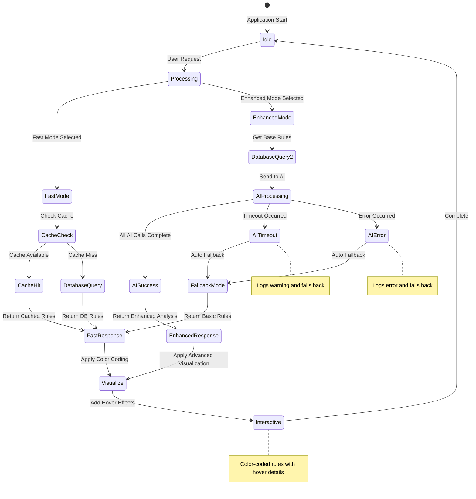
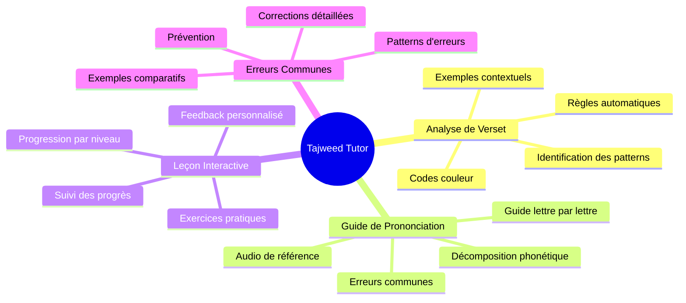
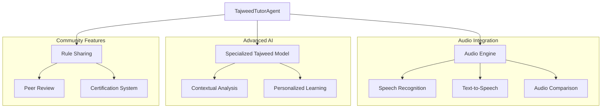

# Tajweed Tutor - Diagrammes d'Architecture

## 🏗️ Architecture Système Complète



## 🔄 Flux de Données - Mode Rapide



## 🧠 Flux de Données - Mode Amélioré



## ⚠️ Gestion d'Erreurs et Fallback



## 🔧 Architecture des Composants



## 📊 Visualisation des Règles de Tajweed



## 📈 Métriques de Performance

```mermaid
gantt
    title Timeline de Performance - Tajweed Tutor
    dateFormat X
    axisFormat %s
    
    section Mode Rapide
    Cache Check        :active, fast-cache, 0, 0.5s
    DB Query           :active, fast-db, 0.5s, 2s
    Rule Processing    :active, fast-process, 2s, 3s
    
    section Mode Amélioré (Actuel)
    DB Query           :done, old-db, 0, 2s
    AI Analysis 1      :done, old-ai1, 2s, 62s
    AI Analysis 2      :done, old-ai2, 62s, 122s
    AI Pronunciation   :done, old-ai3, 122s, 182s
    
    section Mode Amélioré (Optimisé)
    DB Query           :active, new-db, 0, 2s
    Parallel AI 1      :active, new-ai1, 2s, 20s
    Parallel AI 2      :active, new-ai2, 2s, 20s
    Parallel AI 3      :active, new-ai3, 2s, 20s
    Final Processing   :active, new-final, 20s, 22s
```

## 🔄 États du Système



## 🎯 Types d'Analyse Supportés



## 🚀 Architecture Future - Phase 2



---

*Dernière mise à jour : Août 2025*  
*Version : 1.0.0 - Feature Branch: feature/tajweed-enhancement*
